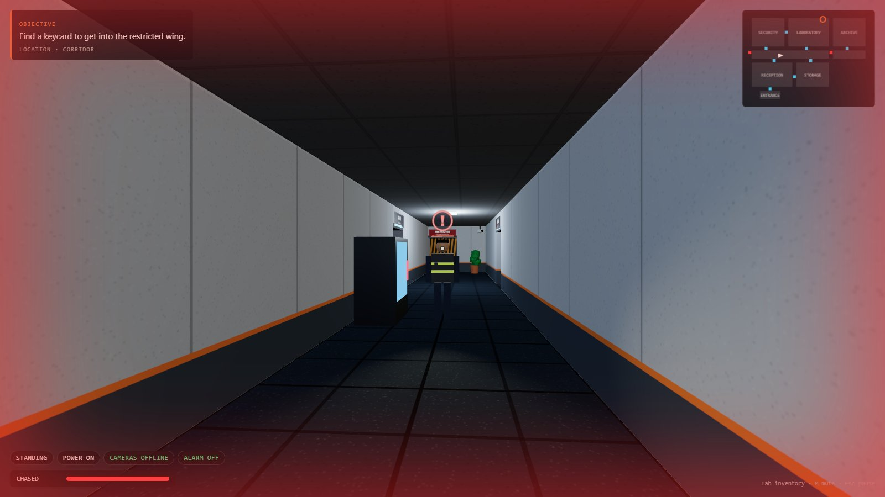

# The Research Facility (Groop · Phase 1)

A small, complete 3D stealth game, built to prove one thing before any Groop AI work: **we can make a real 3D game that is playable, readable and technically solid**.

There's no AI generation, natural-language editing or blueprint system here, on purpose. Those belong to Phase 2.



## The game

Helix Research went dark three nights ago. You enter through reception and must:

1. find the **security keycard** (Laboratory)
2. get through the **security door** into the restricted wing
3. take the **research drive** from the **Archive**
4. escape through the **emergency exit**, which only unlocks once the drive leaves the archive

Get caught by a guard and the run ends.

### Controls

| Key | Action |
|---|---|
| W A S D (or ↑ ↓) | move |
| Mouse (click to capture), or ← → | look / turn |
| Shift | sprint: fast but loud |
| C | crouch (toggle): slow, silent, harder to see |
| E (or F) | interact |
| Tab | inventory |
| Esc | pause |
| M | mute |
| R | play again (end screen) |

Desktop only: it needs a keyboard and mouse. There are no touch controls.

### The facility

The level has eight connected areas:
- **Entrance** and **Reception:** the HELIX front desk, plus a camera.
- **Corridor:** the spine of the building.
- **Security:** the camera monitors and the security terminal.
- **Laboratory:** benches, specimen tanks, and the keycard.
- **Storage:** shelves to hide behind, and the generator.
- **Restricted wing:** behind the keycard door.
- **Archive:** server racks and the research drive.

Two side doors, Reception ↔ Storage and Security ↔ Lab, create loops so you can go around a guard instead of through him. Every doorway is signed, and a minimap shows the plan and your next objective. Guards are not shown on the minimap.

### How the systems connect

These are real game mechanics, not UI effects. Each one is tested (see [TEST_REPORT.md](TEST_REPORT.md)).

| Action | Consequence |
|---|---|
| **Generator off** (Storage, E) | Lights drop to dim amber emergency lighting. **All cameras go offline.** The **security terminal loses power.** Guards' sight range halves (11 m → 5.5 m). The shutdown is loud, so guards within earshot come to investigate the generator. |
| **Crouched and still in the dark** | Your visible range shrinks again: you're a shadow. |
| **Camera sees you for 1.5 s** (2.4 s if crouched) | **Alarm.** Red lights and a siren. Every guard heads to where you were seen. Guards see 35% further, move 20% faster and get suspicious twice as fast. The alarm lasts 60 s, or until it's reset at the terminal. |
| **Security terminal** (needs power) | Turn cameras off or on, and reset an active alarm. |
| **Keycard taken** | The security door accepts you: its light goes red → green and it opens. |
| **Research drive taken** | Lockdown lifts and the emergency exit unlocks. The objective and minimap marker switch to the exit. |
| **Footsteps** | Walking can be heard within 3 m, sprinting within 9 m. Crouching is silent. Walls halve how far sound carries. |

### Guards

Each guard runs a real state machine (`src/ai/guard.ts`). Transitions happen during play and are logged:

```
PATROL ──sees you──▶ SUSPICIOUS ──suspicion fills──▶ CHASE ──loses you──▶ SEARCH ──timer──▶ RETURN ──▶ PATROL
   │                     │ loses you for 1.4 s                                  ▲
   └──hears a noise──────┴──────────────▶ INVESTIGATE ──arrives, finds nothing──┘
```

- **Suspicion builds** while a guard sees you: faster when you're close, slower when you're crouched or far away. It drains when he doesn't.
- **The icon above his head shows his state:** "?" with a fill ring while suspicious or investigating, and "!" when chasing.
- **When he first spots you he freezes for 0.6 s.** That's your window to run, and sprinting (6 m/s) outruns a chase (4 m/s).
- **Getting caught:** within 1.2 m and in his line of sight.
- **Navigation:** guards use A* on a 1 m grid. They open doors for themselves, but not the exit, and not the security door until you've unlocked it.
- **Sight is blocked by** walls, closed doors and tall props (shelves, racks, lockers, tanks).

## How it's built

```
src/level/    map.ts (ASCII floor plan, rooms, guard routes, cameras) · props.ts (furniture as data)
src/world/    the rules, with no rendering: facility.ts (orchestrator), grid.ts (collision, line of sight,
              doors, nav), path.ts + heap.ts (A*), player.ts, doors.ts, cameras.ts, security.ts (alarm),
              interact.ts, types.ts, random.ts
src/ai/       guard.ts (state machine), guard-state.ts, perception.ts (sight + hearing), move.ts
src/render/   Three.js only reads the world: view.ts, level.ts, lights.ts, doors.ts, props*.ts,
              objects.ts (keycard, drive, generator, terminal, cameras), guards.ts, signs.ts,
              textures*.ts (all textures drawn on canvas at load: no image files), merge.ts
src/ui/       hud.ts, minimap.ts, screens.ts      src/audio/sfx.ts (synthesised; no audio files)
src/main.ts   app states (title, playing, paused, terminal, inventory, ended) and the game loop
```

**Key design decision: the game logic never touches Three.js.**
- `Facility.update(dt, input)` is the whole game, as plain data.
- The renderer and HUD only read it.
- That's why all the rules can be unit-tested in Node and simulated thousands of frames a second (`tests/`).

**Stack:** Vite 8, TypeScript 5.9 (strict), Three.js 0.186, Vitest 5, Playwright (tests only). No physics engine and no asset files: shapes, textures and sounds are all generated in code. The build is 605 KB of JS (156 KB gzipped).

## Status

| | |
|---|---|
| Automated checks | 12/12 unit tests, and 25/25 browser checks with real keyboard/mouse input. See [TEST_REPORT.md](TEST_REPORT.md). |
| Performance | 41–52 fps at 1280×720 on Intel UHD integrated graphics |
| Played by a human | **Not yet.** All verification so far is automated. Whether it's *fun* needs your hands on it. |

**Playtesting:** a double-click build and playtest recording are ready. See [PLAYTEST.md](PLAYTEST.md) and [PLAYTEST_BASELINE.md](PLAYTEST_BASELINE.md).

How to run it and how to play the built version: [RUN.md](RUN.md). What changed and why: [CHANGELOG.md](CHANGELOG.md).
